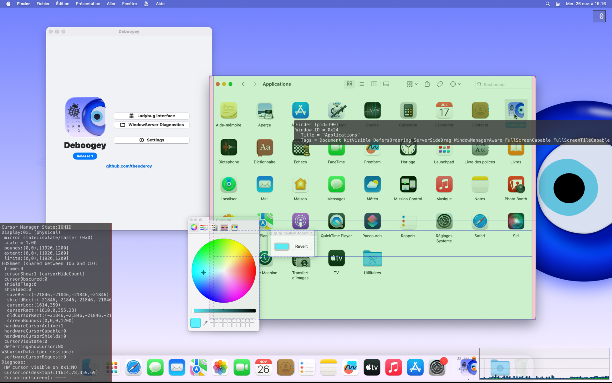

# Deboogey

**Hardened debug inspector for macOS**

## Overview

Deboogey provides low-level debugging tools for macOS applications and system component inspection. It exposes hidden debugging interfaces that are typically disabled in production environments.

## Features

### 🐞 Ladybug Interface
Enable or disable the Cocoa Debug Menu flag for applications:
- **Global Domain**: Apply to all applications system-wide
- **Per-application**: Target specific apps by bundle ID

### 🪟 WindowServer Diagnostics
Access WindowServer's debug overlay system:
- **Framerate & Hang Sensors**: Monitor systemwide performance issues
- **Foreground Debugger**: Track active window states
- **Mouse Tracking**: Verbose cursor interactions
- **Contributor Screen**: View contributors
- **Custom Masks**: Define your own diagnostic combinations

## Requirements

- macOS 13.0+
- **SIP disabled** for system-write features

## Technical Details

- Built with SwiftUI
- Includes two helper executables bundled as resources:
  - `deboogeyLadybugHelper`: Modifies `defaults` settings
  - `ws_overlayHelper`: Injects debug overlays into WindowServer via LLDB

## License

MIT License - see [LICENSE](LICENSE) file
