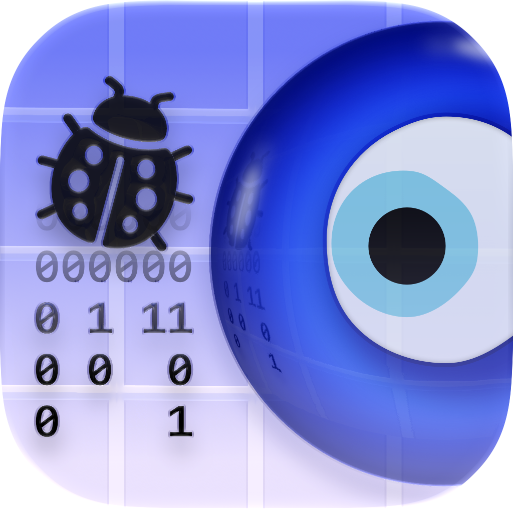
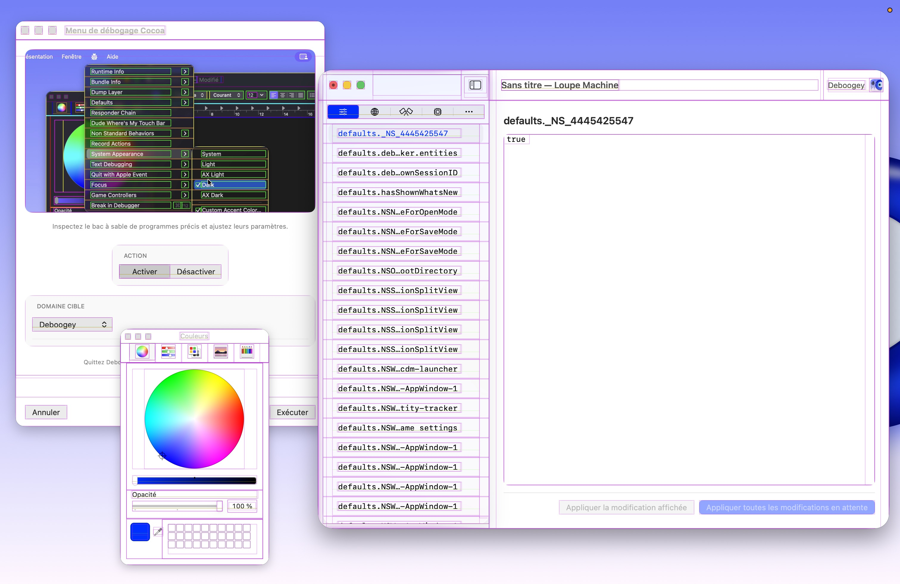

# Deboogey

**Dig into what should be yours.**

## Overview

Deboogey allows you to poke at hidden debugging interfaces built into macOS that are typically inaccessible with an easy-to-use graphical interface.

"Cocoa Debug Menu" allows you to enable a menu bar item for the target of your choice to access some of it's sandbox parameters. "SkyLight Diagnostics" allows you to enable system-wide diagnostic screens, such as the screen's active framerate or the cursor's X and Y position.

## Requirements

- macOS Monterey is required to use Deboogey.
(Release 3.1 or earlier supports macOS installations down to macOS Big Sur)

### Using SkyLight Diagnostics
To use this tool, you need to have accounted for the following:

- "System Integrity Protection" needs to be loosened to allow for debugging on your machine (you do not need to disable it outright).
- "Command Line Tools for Xcode" is required on your machine.
