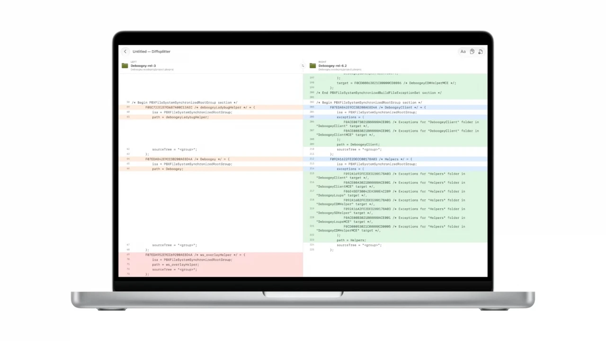

# Deboogey

## Overview

Deboogey brings full-fledged IT and debugging tools to the regular user. It allows people unfamiliar with compares and variable-prying tools to get started using it's versatile toolset while being advanced enough to be used professionally.

"Loupe Machine" allows you to select an application and inspect or edit its defaults, global defaults, system feature flags, and binary flags. "Diffsplitter" allows you to compare two text files, folders, or archives side by side, including nested archives. "Cocoa Debug Menu" allows you to enable a menu bar item for the target of your choice to access some of its sandbox parameters. "SkyLight Diagnostics" allows you to enable system-wide diagnostic overlays, such as the screen's refresh rate, collision boxes, or the cursor's position. "Entity Tracker" allows you to review and revert modifications made by those tools.

## Requirements

- iOS, iPadOS or visionOS 27 is required to use Deboogey on iPhone, iPad and Apple Vision platforms.

- macOS Monterey is required to use Deboogey on Mac platforms. (Some older versions support macOS installations down to macOS Big Sur)

### Using SkyLight Diagnostics

To use this tool, you need to have accounted for the following:

- "System Integrity Protection" needs to be loosened to allow for debugging on your machine (you do not need to disable it outright).
- "Command Line Tools for Xcode" is required on your machine.

